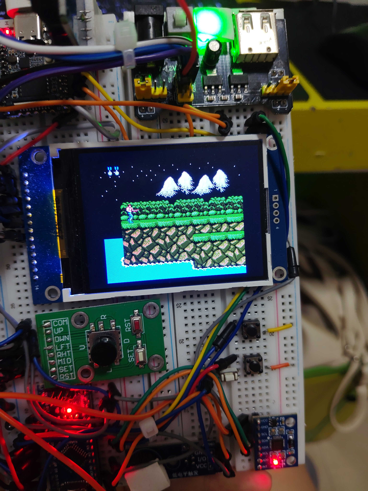
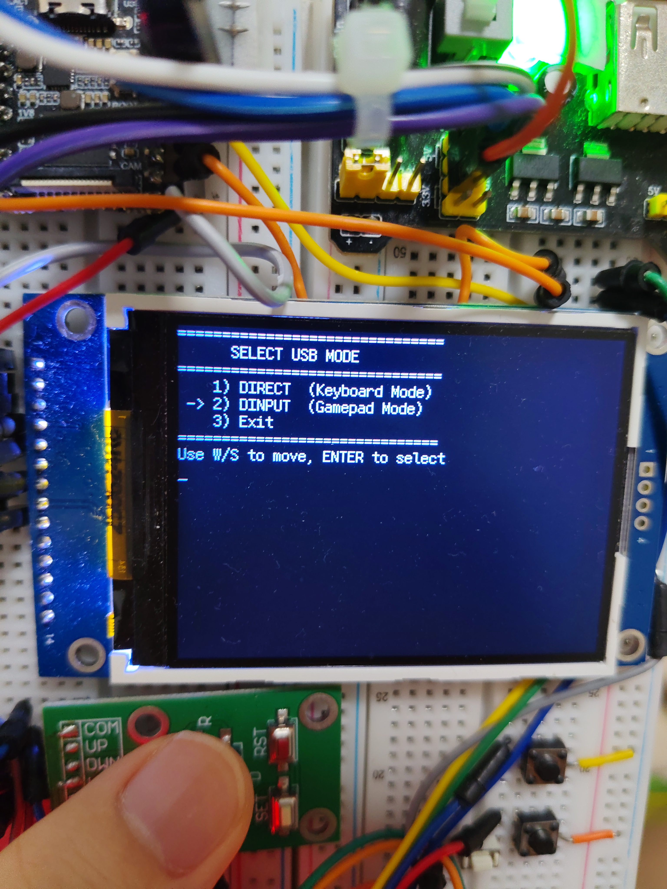
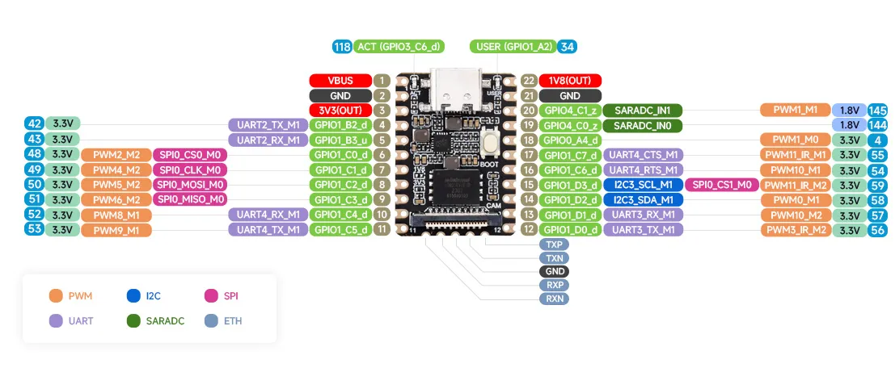

# Miku-Console 智能游戏终端
大家好！这是来自葱酱的全新设计——一台基于 Rockchip RV1103 与 Arduino Nano 的开源掌机。
它支持多种游戏格式（比如常见的`.nes`、`.a23`（Atari）、支持 SD 卡与文件系统扩展、支持`.mp3`、`.wav`与经转码的`.mid`格式音频的播放。






在经过针对嵌入式设备的特调，支持自定义字体、真彩色 ANSI 转义与 Emoji 字符输出功能的`fbterm-truecolor`的技术加持下，掌机支持非常简单的 CLI 程序侧载与二次开发，且支持使用 C / C++ / Python（需在 buildroot 中开启）/ Shell 语言编写的原生 CLI 程序，且可以接收实体按键作为标准输入流。为演示其功能与强大的扩展性，掌机中的音乐播放器、独立游戏`meow-rpg`均通过纯 CLI 形式开发。

同时，这台设备集成了 DS1302 时钟芯片与 MPU6050 姿态传感器的支持，它可以轻松的设置为 HID 模式与电脑建立连接，并通过`Xinput`协议作为手柄与各大游戏建立连接，可以使用重力感应与实体按键流畅游玩《异环》等大型游戏、《极品飞车》等竞技游戏，以及通过`Direct input`模式与 FCEUX 等小游戏模拟器建立连接，可以在电脑上游玩各种复古游戏。

如果有更好的建议与 Bug 反馈，欢迎在 issue 中进行反馈！

> **硬件设计进行中**
> 目前，`Miku-Console`还处于模块存在变动的开发阶段，选择在这个时候发布，主要考虑了软件与基本硬件设施的完备性。
> 因此，`Miku-Console`还没有完整的原理图和 PCB 设计文件，但我会在本文中提供设备的接线要求与当前的物料清单。
> 在实体硬件设计完成之后，所有硬件设计部分的产物将发布到`Hardware/`文件夹。

## 物料清单
组装一台`Miku-Console`非常简单，需要的物料价格在 50~65 元人民币左右。以下是于 2026 年 8 月 11 日发布的预览版本所需的元器件：

- **主控：** Luckfox Pico Mini B (128M NAND Flash)
- **协处理器：** Arduino Nano ATMega328P 或兼容版本
- **屏幕：** 支持 4 线 SPI 的 ST7789v 液晶显示屏（分辨率 320x240）
- **按键：** 
  1. 6x6x5 微动按键5个，作为功能键输入
  2. 五向开关 x1，作为主控制手柄输入
- **姿态传感器：** MPU6050 六轴加速度传感器
- **电源：** 至少需要一个 3.3v LDO/DCDC 降压模块，获取稳定供电
- 电容、电阻、杜邦线若干，电容需要放在处理器芯片的附近

**选配部分：**
- **蜂鸣器：** 搭配放大三极管的无源蜂鸣器模块
- **RTC：** DS1302 实时时钟模块
- **电源部分：** 可自由选择是否安装电池

## 线路连接
### Arduino Nano
| 单片机管脚 | 连接的外设/功能 |
| :--- | :--- |
| Pin 2 | 按键 A(F1) |
| Pin 3 | 按键 B(F2) |
| Pin 4 | 按键 Left(A) |
| Pin 5 | 按键 Right(D) |
| Pin 6 | 按键 Down(S) |
| Pin 7 | 按键 Up(W) |
| Pin 8 | 按键 Space |
| Pin 9 | 按键 Enter |
| Pin 10 | 按键 Tab |
| Pin 11 | 按键 Exit |
| Pin 12 (RX) | RV1103 TX (软件串口接收端) |
| Pin 13 (TX) | RV1103 RX (软件串口发送端) |
| A0 | USB OTG 状态检测 (VIN 检测) |
| SDA / SCL | I2C 通信总线 (从机地址 0x08) |

### RV1103
引脚序号请以下图为准：


| 左侧 | 外设 | 右侧 | 外设 |
| :--- | :--- | :--- | :--- |
| GPIO1_B2 | LCD DC | GPIO4_C1 | DS1302 CLK |
| GPIO1_B3 | LCD RS | GPIO4_C0 | DS1302 DAT |
| GPIO1_C0 | LCD CS | GPIO0_A4 | DS1302 RST |
| GPIO1_C1 | LCD SCK | GPIO1_C6/C7 | 悬空 |
| GPIO1_C2 | LCD MOSI | GPIO1_D3 | I2C SCL |
| GPIO1_C3 | LCD MISO | GPIO1_D2 | I2C SDA |
| GPIO1_C4 | LCD BL | GPIO1_D1 | RX -> Arduino TX |
| GPIO1_C5 | 蜂鸣器 PWM | GPIO1_D0 | TX -> Arduino RX |

请注意，为了供电稳定与减少噪声，建议在 Arduino 和 RV1103 的电源插针附近加上一颗 10-50微法的电解电容，以抵消插入耳机时的电流干扰。同时，请将 **蜂鸣器** 和 **MPU6050** 的电源接入稳压器的 3.3v 输出，以获取更稳定的体验。

另外，MPU6050 与 Arduino 的 I2C 引脚需要接在一起，这是一条 I2C 通信总线。

## 程序的编译和下载
请 [参考这个链接](https://wiki.luckfox.com/zh/Luckfox-Pico-Plus-Mini/Flash-image) 进行对应平台的工具获取。

### 镜像烧录
在 Windows 下，安装驱动后，进入官方工具链提供的 `SocToolkit.exe` 下载工具，选择“RV1103”，进入 USB 下载模式。

你可以在我提供的镜像文件中看到这些内容：

```plaintext
.
├── boot.img
├── download.bin
├── env.img
├── idblock.img
├── oem.img
├── rootfs.img
├── sd_update.txt
├── tftp_update.txt
├── uboot.img
├── update.img
└── userdata.img
```
如果是第一次安装或者进行全量替换，请选择 **固件...** ，选中`update.img`；
此时，请按住开发板的 BOOT 按键，插上 USB 电缆，在电脑发现新设备后，点击“升级”即可。

如果是进行部分更新，请选择 **搜索路径**，选择路径后，手动勾选和指定需要的文件。并且点击 **下载**。

### 用户程序烧录
对于工具链与 ADB 的配置，请参考 [官方文档](https://wiki.luckfox.com/zh/Luckfox-Pico-Plus-Mini/Login)。

在设备烧录镜像并启动之后，一段时间后，电脑将发现一个新设备。此时，在终端输入：
```bash
adb devices
```
可以显示当前的设备。

如果发现设备，可以尝试输入`adb shell`来查看设备是否可以进入终端。
我们获取用户程序文件`sysdump.tar`后，电脑执行
```bash
adb push ./sysdump.tar /oem
```
完成后，输入`adb shell`进入终端，执行：
```bash
cd ~
rm -rf usr/
tar xvf ./sysdump.tar
rm ./sysdump.tar
reboot
```
重启后，屏幕就点亮了，并且可以成功进入桌面。
如果显示异常，可以在`adb shell`的终端中执行以下命令：
```bash
fb_dtbo_config
```
此时，终端会显示一个交互程序，可以选择屏幕的显示参数：
```bash
========================================
      Screen Configuration Utility
========================================
Current Screen: [ st7789v_rot90_fps60.dtbo ]
----------------------------------------
Available Configurations:
  1) st7789v_rot90_fps60.dtbo
  2) st7789v_rot90_fps60_bgr.dtbo
----------------------------------------
q) Quit

Select an option (1-2):
```
目前，设备仅支持`st7789v`显示屏。如需支持更多显示屏，请自行在下文的开发工具链中进行设备树修改、

### 全量构建
Miku-Console 掌机的代码是完全开源的，且提供所有代码与构建工具，可以自由定制和侧载程序：

请确保在拉取镜像的时候使用的是全量拉取指令：
```bash
git clone --recursive "git@<path-to-repo>"
```
否则，请执行：
```bash
git submodule update
```

请确保网络畅通，第一次全量构建需要下载大量文件，且需要大约 10-30 分钟的编译时间。
在工作目录`Software/RV1103/`下，执行：
```bash
make
```
即可完成编译，编译之后的系统固件与用户程序安装包会输出到工作目录的`dist/`文件夹。

有关工具链详细配置、交叉编译等开发相关知识，请移步 [官方网站](https://wiki.luckfox.com/zh/Luckfox-Pico-Plus-Mini/SDK-Image-Compilation)

### Arduino 代码烧录
本项目代码使用 Arduino IDE 构建，清先下载 Arduino IDE，选择开发板、串口和 Bootloader 版本。将本项目的`Software/Arduino/main/main.cpp`的代码内容复制到 IDE 的新建程序中，点击“下载”按钮进行烧录即可。

注意，在下载程序之后，Arduino 同时会承担 RV1103 的应急串口终端转发功能，要链接串口，请选择 **38400** 波特率，并在第一次连接后输入一个回车；
根据系统提示，输入账户名和密码：
```bash
Username: root
Password: admin
```
即可在 ADB 服务不可用时，通过串口进行终端连接。

## 功能介绍
Miku-Console 掌机的功能非常丰富。下面是功能和应用的介绍：

### 键盘映射
它的按键输入通过 Arduino Nano 进行扫描，并且打包成一个 3 字节的数据帧，每秒发送 60 次给主机。Arduino Nano 同时兼顾检测 USB 连接主从状态的功能，发送的数据帧功能如下：

| Byte 2 | Byte 1 | Byte 0 |
| :--- | :--- | :--- |
| Bit `[16:16]` | Bit `[9:8]` | Bit `[7:0]` |
| USB 主从位 | 按键 | 按键 |

*注：按键的位序与实体连接的位序一一对应，可参考 Arduino 源码。*

主机上的 `virtual_keypad` 守护程序扫描按键后，通过 `uinput` 与 `libevdev` 注册为系统的标准键盘输入 `/dev/input/event0` 节点。默认的键盘映射配置文件为 `/oem/key_mappings/default.conf`，它在系统上电的时候会自动拷贝到 `/oem/usr/etc/virtual_keypad.conf`。在默认情况下。掌机的按键布局对应的系统输入事件如下：

```plaintext
++++++++++++++++++++++++++++
+     W      Tab       1   +
+ A Space D                +
+     S     Enter Esc  2   +
++++++++++++++++++++++++++++
```
### 桌面导航
系统启动后，最先进入的是使用 `LVGL` 编写的桌面，在桌面上，使用摇杆的上/下方向来切换选项，通过按下摇杆中心按钮或 Enter 键确认。桌面模式下，右侧的游戏功能键 1/2 可以用于调节音量，音量支持断电保存，如果未插入耳机，显示屏左下角会弹出 `Can't found SPK` 的悬浮窗提示。按下结束（Esc）按钮，可以关闭屏幕背光并锁定屏幕，锁屏模式下，按下任意按键可以唤醒屏幕。

如果需要在两个横向并行的选项中切换，请使用摇杆的左/右方向。

桌面上共有下面的应用程序：
- **Meow RPG**
  葱酱开发的独立 CLI 游戏，目前处于内测阶段。
- **NES Emulator**
  NES 模拟器，可以读取 `/oem/nes_games` 和 `/sdcard/nes_games` 中的 NES 游戏文件，并显示在列表中。
- **Stella**
  Atari 游戏模拟器，可以读取 `/oem/atari_games` 和 `/sdcard/atari_games` 中的 `.bin` 或 `.a23` 游戏。
- **Termainal**
  打开命令提示符窗口，终端通道为`/dev/console`，按下 Enter 可以退出。
- **Joystick Mode**
  用于连接电脑的手柄模式
- **Music**
  CLI 音乐播放器，可以播放 `/sdcard/music` 和 `/oem/usr/share/audio` 中的 `.mp3` 和 `.wav` 音乐文件，支持多种播放模式。
- **Settings**
  设置，目前可以设置时间和显示格式
- **About**
  关于
- **Reboot**
  重启设备

### 游戏模拟器
系统支持 NES 与 Atari 两种游戏模拟器。在游戏模拟器模式下，如果在开发板的 USB C 剪口上连接耳机，均可以支持输出音频。

在游戏模式下，系统会复制 `/oem/key_mappings`中相应的按键映射文件到主配置目录，并激活按键控制器读取游戏对应的键盘设置，相应的按键与游戏功能映射如下：

| 实体按键 | NES | Atari |
| :--- | :--- | :--- |
| W | Up | Up |
| A | Left | Left |
| S | Down | Down |
| D | Right | Right |
| Space | Select | Select |
| Enter | Confirm | OK |
| Tab | 留空 | F3 |
| 1 | A | Space |
| 2 | B | F1 |
| Esc | Exit | Exit |

在游戏界面中，按下退出键会关闭当前游戏，并返回主界面。

### Meow RPG
Meow RPG 是一个使用 C++ 编写的终端文字游戏，目前仍在开发阶段。它是一个使用“摄像机视角”的二维游戏，键盘操作如下：

| 实体按键 | 功能 |
| :--- | :--- |
| W | Up |
| A | Left |
| S | Down |
| D | Right |
| Space | Confirm |
| Enter | Confirm |
| Tab | 交互 |
| 1 | 背包 |
| 2 | 攻击（开发中） |
| Esc | 退出 |

这款游戏完全基于 `fbterm-truecolor` 的 ANSI 转义字符和 Emoji 实现，目标是打造一款类似于“星露谷物语”的休闲终端游戏，未来可能还会加入联机、养成等机制。

### 终端
你可以在游戏机上打开终端，且把标准输出在 `adb shell` 中直接重定向到它的输出上，以测试显示效果或者查看调试信息。

终端默认以 Root 用户打开，如需显示内容，可以在电脑端输入：

```bash
[你的可执行文件] > /dev/console < /dev/tty1 2>&1
```
按下 Enter 按键，结束终端会话并返回主界面。

### 手柄模式
进入 `Joystick Mode` 后，设备将进入手柄模式，可以选择两种模式，按 W/S 按键选择，Enter 确认。

#### 基础设置
提供的两种模式分别是：
1. **Direct Mode**
   设备将在计算机上注册为一个 **键盘**，直接输入字符，可以游玩一些配置方式简单且标准不统一的小游戏。包括 FCEUX。
2. **DInput Mode**
   设备作为 **手柄** 接入计算机，并将摇杆与加速度传感器映射为两个手柄轴输入。此时，摇杆中心键 Space 将变成 Fn 键，按下 Fn 键后，所有的按键将会发出不同的按键编码（类似于计算机上的 Shift）。以支持 Xbox 通用手柄的按键数量需求。

> **注意**
> 现代游戏可能已不支持 DInput 手柄协议，因此，你需要安装一个[XOutput](https://github.com/csutorasa/XOutput) 来绑定按键与接入游戏。在此感谢开发者 [@csutorasa](https://github.com/csutorasa) 的开源。

#### 自定义模式
手柄模式支持自定义，配置文件分为键盘模式与手柄模式两种，它们位于`/oem/usr/etc/hidconfig`下。
**键盘模式：**
键盘模式的配置文件声明了自己的`TYPE`和`NAME`字段，这将在选择`Direct`模式后弹出的二级选项中展示。
```ini
type=DIRECT
name=FCEUX Default
HW_KEY_UP=HID_KEY_UP
HW_KEY_DOWN=HID_KEY_DOWN
HW_KEY_LEFT=HID_KEY_LEFT
HW_KEY_RIGHT=HID_KEY_RIGHT
HW_KEY_A=HID_KEY_F
HW_KEY_B=HID_KEY_D
HW_KEY_START=HID_KEY_ENTER
HW_KEY_SELECT=HID_KEY_S
HW_KEY_L3=HID_KEY_SPACE
```

在声明类型之后，下方的键值对绑定了实体按键与输出到电脑的按键，这里的实体按键`HW_KEY`在面板上的位置如下：

```plaintext
+++++++++++++++++++++++++++++++
+       UP         SELECT   A +
+ LEFT  L3  RIGHT             +
+      DOWN        START    B +
+++++++++++++++++++++++++++++++
```
*也就是，`HW_KEY`的规则是按照 NES 的键位意义来编写的，让使用者看起来更加直观*

右侧的`HID_KEY`为输出到电脑的标准键盘事件，可以选择所有字母、数字、Fx按键，以及 Space 、Ctrl、Alt 等功能键。

**手柄模式：**
手柄模式的配置文件如下，此处以系统默认的`dinput_rpg.conf`为例：
```ini
type=DINPUT
name=RPG
AXIS_GSENSOR=STICK_RIGHT
AXIS_DPAD=STICK_LEFT
HW_KEY_A=BTN_A
HW_KEY_B=BTN_X
HW_KEY_START=BTN_RIGHT_THUMB
HW_KEY_SELECT=BTN_LEFT_THUMB
HW_KEY_L3=BTN_FN
FKEY_HW_KEY_A=BTN_B
FKEY_HW_KEY_B=BTN_Y
FKEY_HW_KEY_START=BTN_RB
FKEY_HW_KEY_SELECT=BTN_LB
```
同样的，它也声明了自己的类型与名称，它的按键定义分为三种：
1. **轴** （`AXIS_xxx`）
   分为了`AXIS_GSENSOR`（重力）和`AXIS_DPAD`（摇杆），可以选择映射到 Xbox 手柄的左摇杆和右摇杆。
2. **按键** （`HW_KEY`）
   它们可以分配为常规的 PS2 / Xbox 手柄的按键，`BTN_xx`为手柄按键的宏定义，如手柄的 A、B、X、Y、扳机键、肩键、功能键等。
   所有手柄按键的定义与按键的二进制码如下：
   ```C
    {"BTN_A", 0x01}, {"BTN_B", 0x02}, {"BTN_X", 0x04}, {"BTN_Y", 0x08},
    {"BTN_LB", 0x10}, {"BTN_RB", 0x20}, {"BTN_BACK", 0x40}, {"BTN_START", 0x80},
    {"BTN_LEFT_THUMB", 0x100}, {"BTN_RIGHT_THUMB", 0x200},
    // Special Fn Button
    {"BTN_FN", 0xFF}
   ```
   尤其重要的是 `BTN_FN` 宏，它指定了一个特殊的按键 Fn，Fn 可以不声明、声明一个或多个。按下 Fn 后，所有其余按键的执行将会查找 Fn 映射表；
3. **Fn绑定** （`FKEY_`字段）
   在常规的按键宏前面加上 `FKEY_` 头部，会变成这一物理按键的 `FN` 行为映射，一个物理按键必须绑定一个基础功能，可以选择绑定 Fn 组合键功能，当按下 Fn 按键，所有绑定了 Fn 的按键会向电脑发送 Fn 对应的按键码，如果没有绑定，则会保持输出原始的按键码。所有物理按键的按键码可以叠加（通过 `OR` 位运算）

### 音乐
在将耳机插入最小系统板的 USB-C 接口之后，系统将读取该耳机为 OTG USB 设备，此时，**Music** 应用变为可打开状态，桌面左上角也会出现音频标志。

音乐播放器为 TUI 形式，它会扫描 SD 卡上的`.mp3`和`.wav`音频文件，并且加入列表中。音乐播放器的界面如下：
```plaintext
 音乐播放器  [🔁 列表循环]

 播放: 未选择歌曲
[00:00]⚪━━━━━━━━━━━━━━━━━━━━━━━━━━━[00:00]

 * 文件列表 *
  test.mp3
  test.wav
  Ayase,初音ミク - フィクションブルー (1).
  livetune,初音ミク - Star Story.mp3
  supercell,初音ミク - メルト.mp3
  一之瀬ユウ,初音ミク - 嗚咽.mp3
  doriko,初音ミク - 雪がとける前に (1).mp3

 控制面板
 [⏮️ 上一曲] [⏸️ 暂停] [⏭️ 下一曲] [🔀 模式] [⏹️ 退出]
Vol: 75%
```

而且，在真实终端中，因为加入了 ANSI 颜色控制字，界面会更加美观与直白。

音乐播放器中，摇杆的 W/S 用于切换播放列表上的焦点，而 A/D 切换选项卡的焦点，Enter/Space 确认，为了在确认按下的时候不产生歧义，我们规定使用 Tab 键切换聚焦的焦点，聚焦到的位置会有高亮显示。

音乐播放器中，通过将光标移动到“退出”上执行退出，按下 Esc 键会锁定屏幕，按下 A/B 按键会调大、调小音量，音量会显示在左下角的弹出窗口上。

## 应用开发与SDK
在执行一次 `make` 之后，系统会自动在工作目录下安装 RV1103 交叉编译工具链以及 Buildroot 构建系统，你可以参考 Luckfox 官网进行 IO 接口的配置和应用开发，如需开启 Python 功能，请在
```bash
cd luckfox_toolchain
./build.sh buildrootconfig
```
进行修改。
如果需要修改驱动，那么可以执行
```bash
./build.sh kernelconfig
```
修改内核驱动开关，以及在
```bash
ls sysdrv/source/kernel/arch/arm/boot/dts/rv1103g-luckfox-pico-mini.dts
```
这一目录下修改设备树和绑定 GPIO。

## 联系我
你可以发邮件给葱酱，也可以提出 issue。
我的邮箱是：1352218398a@gmail.com
如果想要赞助，也可以去我的[个人博客](https://snowmiku-home.top)赞助我！
